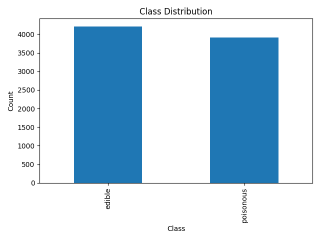
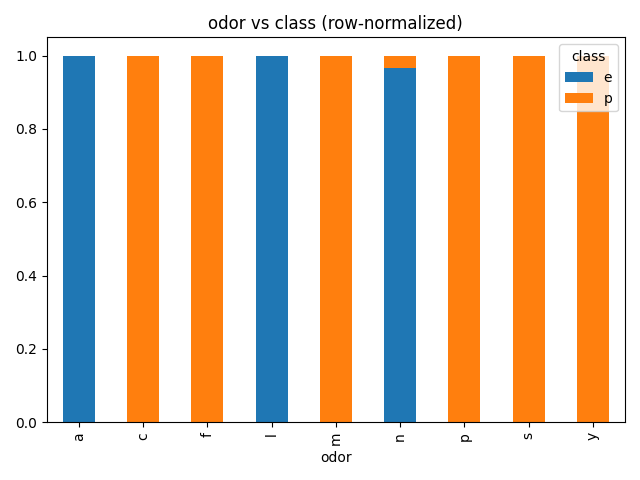
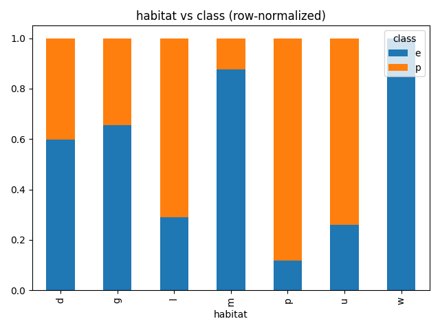
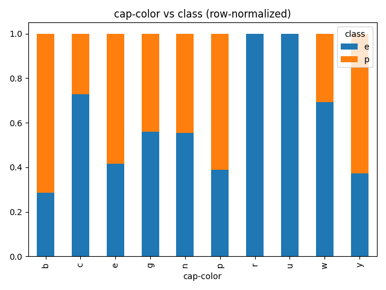
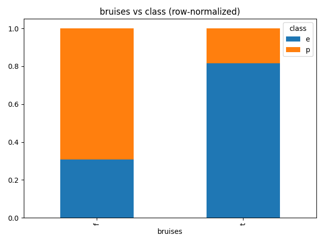
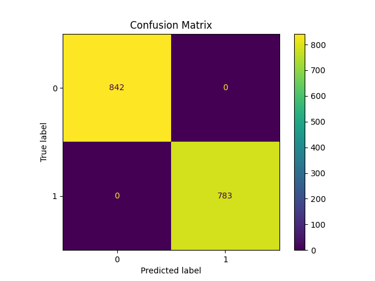

# Mushroom Classification

## Overview
This project uses machine learning to classify mushrooms as edible or poisonous based on their features.

## Features
- Data preprocessing and cleaning
- Handling missing values
- Model training and evaluation using cross-validation
- Streamlit web app for user interaction

## Technologies Used
- Python
- Pandas
- Scikit-learn
- Streamlit
- Joblib

## How It Works
Users input mushroom characteristics, and the model predicts whether it is edible or poisonous.

## Project Structure
- app.py → Streamlit application
- mushroom_classification.ipynb → Data analysis and model training
- mushroom_model.joblib → Saved trained model
- The rest of the files are the results of the analysis of the data, or the dataset povided by UCI

## Key Learning Outcomes
- Built end-to-end ML pipeline
- Applied data preprocessing techniques
- Evaluated models using cross-validation
- Developed a simple UI for predictions

## Running the App
1. Install dependencies:
   pip install streamlit pandas scikit-learn joblib
2. Run the UI:
   python -m streamlit run app.py
   Or
   py -m streamlit run app.py

## Using the Classifier
- Go to the "Classifier" page in the sidebar.
- Fill in all fields using UCI attribute codes, or load a sample.
- Click "Predict" to see the model’s output.

## EDA
- "EDA Visuals" shows plots generated from the dataset.

## Data Visualizations

### Class Distribution

- Distribution of poisonous vs edibile mushrooms

### Odor vs Class

- Odor is a strong predictor, with certain smells clearly associated with poisonous mushrooms.

### Habitat vs Class

- Habitat shows noticeable patterns, where some environments have a higher proportion of poisonous mushrooms.

### Cap Color vs Class

- Cap color provides moderate distinction, though there is overlap between edible and poisonous classes.

### Bruises vs Class

- The presence or absence of bruises is a useful indicator, with bruising mushrooms more likely to be edible.

---

## Model Performance

### Confusion Matrix

- The confusion matrix shows high classification accuracy with very few misclassifications between edible and poisonous mushrooms.
